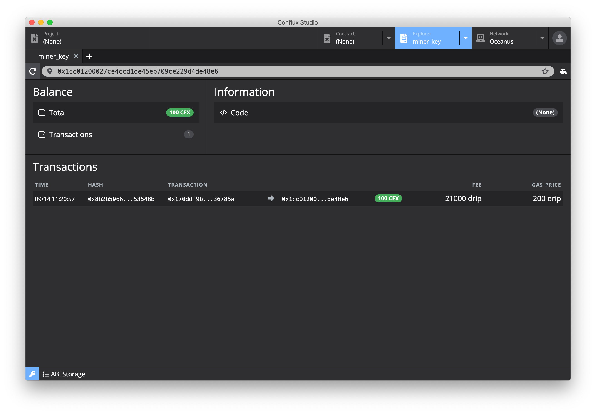
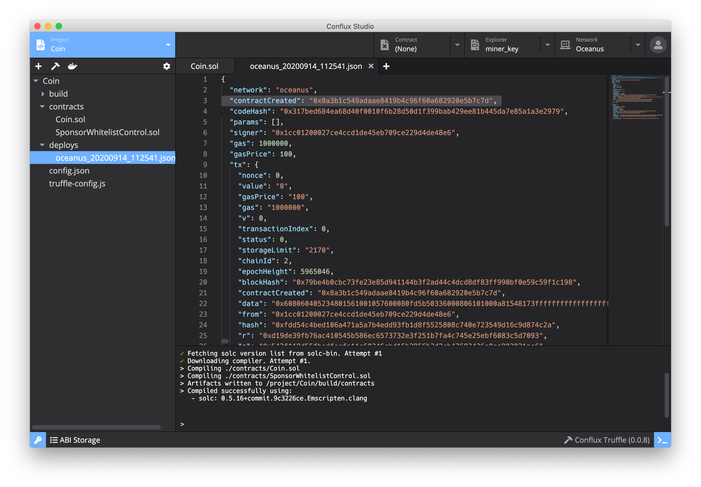
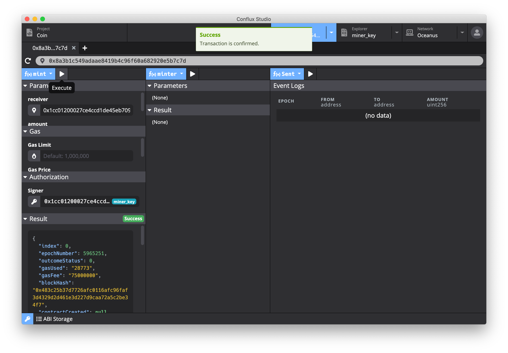
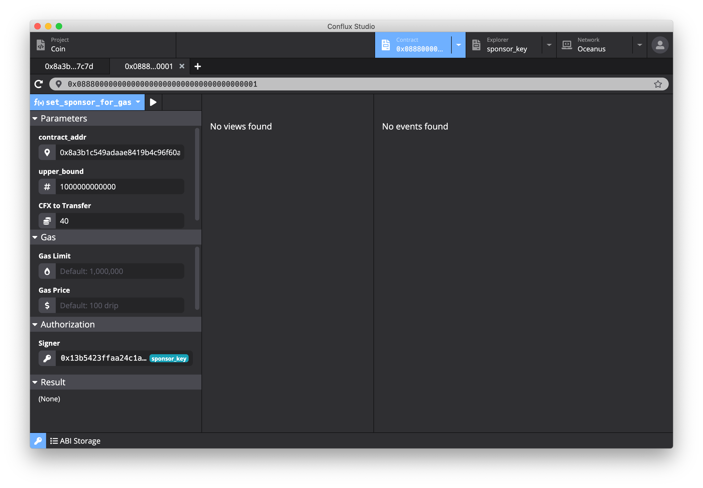
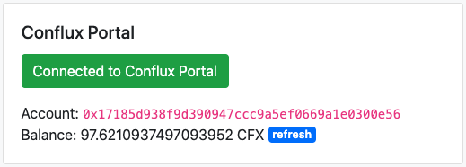

# Tutorial for Conflux Studio DApp Development

English | [简体中文](https://github.com/ObsidianLabs/conflux-dapp-tutorial/blob/master/README-CN.md)

## Catelog

- [Introduction](#Introduction)
- [Preparation](#Preparation)
- [Smart Contract](#Smart-Contract)
- [Call Contract](#Call-Contract)
- [sponsorship function](#sponsorship-function)
- [Front-end Project](#Front-end-Project)
- [Summary](#Summary

## Introduction

We will use [Conflux Studio](https://github.com/ObsidianLabs/ConfluxStudio) to develop a simple token application - Coin, under the Oceanus network in this tutorial.

With this tutorial, users can learn how to write and call Conflux smart contracts, configure smart contract sponsors, and how to use web front-end projects to interact with smart contracts to develop a complete DApp that includes the front-end and smart contracts.

If there are any problems while reading the tutorial, please report it on [Github Issues](https://github.com/ObsidianLabs/conflux-dapp-tutorial/issues).

## Preparation

### Install IDE

Please download Conflux Studio from the [download page](https://github.com/ObsidianLabs/ConfluxStudio/releases) of GitHub. Currently Conflux Studio supports macOS, Linux and Windows systems, please download the corresponding version according to your computer system.

After installing Conflux Studio correctly and starting it for the first time, users will see a welcome page. Please follow the prompts to complete the download, installation and startup of Docker, Conflux Node and Conflux Truffle.

<p align="center">
  
</p>

### Create Wallet

After installation, first users need to create a keypair to continue the following contract deployment and calling.

Users can open the keypair manager by clicking the key icon at the bottom left on any interface of Conflux Studio. Click the *Create* button to open the New Keypair pop-up window, enter the name of the keypair and click the *Save* button. And then users will see the address of the keypair generated in the keypair manager. A keypair consists of a private key and a public key. The public key is also called address in smart contracts.

To export the private key, users can click the eye-shaped button behind each address to open the private key pop-up window, which displays the address and the private key. In following steps, users will need to export private keys through the manager.

<p align="center">
  
</p>

Three keypairs are needed to finish this tutorial:

- `minter_key`: used for the signature of Coin contract deployment and is the most frequently used keypair in this tutorial
- `receiver_key`: used to receive transfers in the Coin contract, and will be used when transferring
- `sponsor_key`: used for the Coin contract sponsorship function, which will be used in the sponsorship function sponsorship [sponsorship function](#sponsorship-function)

### Connect to Conflux Network

Contract deployment and calling in this tutorial will be based on the Oceanus network. Click the inverted triangle of the *Network* label at the top to open the drop-down menu. Select the *Oceanus* network.

And then users will see on the main page that the current network is *oceanus*. The left side of the page displays the node *URL*, *Chain ID*, and *TPS* information of the current network, and the right side shows the block information of the current network.

<p align="center">
  
</p>

### Apply for Testnet Tokens - CFX

Click the *Explorer* tab at the top to open the block explorer, and paste the keypair address in the address bar, then users can see the CFX balance of the pasted address on the left.

<p align="center">
  
</p>

In the blockchain world, the method of applying for testnet tokens is called faucet. Currently, the total of tokens applied by each faucet under the Oceanus network is 100 CFX.

There are two ways to get CFX:
- After entering the address, click the faucet-shaped icon on the right side of the address bar, and then Conflux Studio will automatically apply for CFX for the address.
- Users can also directly enter  `https://wallet.confluxscan.io/faucet/dev/ask?address={address}` in a browser to apply for CFX.

<p align="center">
  
</p>


Please use the above mentioned methods to apply for CFX Tokens for `minter_key` and `sponsor_key` in Conflux Studio. After application, the balances on the two accounts will be updated from 0 CFX to 100 CFX.

The current balance is:

- `minter_key`: 100 CFX
- `receiver_key`: 0 CFX
- `sponsor_key`: 100 CFX

## Smart Contract

### Create Project

Click the *Project* tab on the top left, switch to the project list page, click the *New* button on the right,the Create a New Project pop-up window will jump out. Enter Project Name and choose *coin* Template, and then click *Create Project*.

<p align="center">
  
</p>

### Contract Code

The Coin contract is a simple token contract in which:

- The *mint* method can be used to issue additional tokens.
- The *send* method can be used to transfer a certain amount of tokens to others , and the transfer information will be recorded in the event.
- The *balanceOf* method can be used to query the token balance of a given address.
- The *addPrivilege* method can be used to add addresses to the sponsor whitelist.
- The *removePrivilege* method is used to remove addresses from the sponsor whitelist.

<p align="center">
  
</p>

The Conflux smart contract is developed using the [Solidity](https://github.com/ethereum/solidity) language. Open the `contracts/Coin.sol` file in the directory. This is the core code of the project:

``` c++
// Specify the version of Solidity, and tell the compiler that the compatible version of this code is 0.5.0 to 0.7.0 through Pragmas (https://solidity.readthedocs.io/en/latest/layout-of-source-files.html#pragmas)
pragma solidity >=0.5.0 <0.7.0;

// import the SponsorWhitelistControl contract
import "./SponsorWhitelistControl.sol";

// import the SponsorWhitelistControl contract
contract Coin {
    // two State Variables are defined (https://solidity.readthedocs.io/en/latest/structure-of-a-contract.html#state-variables)
    address public minter;
    mapping (address => uint) private balances;

    // Use the SponsorWhitelistControl contract to connect to the system contract
    SponsorWhitelistControl constant private SPONSOR = SponsorWhitelistControl(address(0x0888000000000000000000000000000000000001));

    // define the event of `Sent` and the from / to / amount column
    event Sent(address from, address to, uint amount);

    // the constructor of the Coin contract, specify the address of the minter in the constructor
    constructor() public {
        // msg.sender is the address of the account signed when deploying the contract, assign this address to minter
        minter = msg.sender;
    }

    // define the mint method, through which tokens can be issued
    function mint(address receiver, uint amount) public {
        require(msg.sender == minter);
        require(amount < 1e60);
        balances[receiver] += amount;
    }

    // define the send method, through which tokens can be transferred to other accounts
    function send(address receiver, uint amount) public {
        require(amount <= balances[msg.sender], "Insufficient balance.");
        balances[msg.sender] -= amount;
        balances[receiver] += amount;
        // trigger the Sent event by the emit method to record the transfer information
        emit Sent(msg.sender, receiver, amount);
    }

    // define the balanceOf method, which is a view type method for querying the account balance
    function balanceOf(address tokenOwner) public view returns(uint balance){
      return balances[tokenOwner];
    }

    // define the addPrivilege method, call the system contract method addPrivilege to add the address to the contract sponsor whitelist
    function addPrivilege(address account) public payable {
        address[] memory a = new address[](1);
        a[0] = account;
        SPONSOR.addPrivilege(a);
    }

    // define the removePrivilege method, call the system contract method removePrivilege to remove the address from the contract sponsor whitelist
    function removePrivilege(address account) public payable {
        address[] memory a = new address[](1);
        a[0] = account;
        SPONSOR.removePrivilege(a);
    }
}
```

### Compile and Deploy Contract

Click the *Build* button (hammer-shaped) on the toolbar to compile the contract. The compilation result will be saved in the `build/Coin.json` file.

<p align="center">
  
</p>

Click the deploy button in the toolbar to open the *Deploy* modal. You can enter constructor parameters, signer, gas limit and gas price for the deployment. In the `constructor` of the contract code, `minter` is assigned the value `msg.sender`, which is the address of signer.

<p align="center">
  
</p>

After deployment, the result will be shown in the json file under the `deploys` folder. In this file, users can find the address of the current contract deployment in `contractCreated`. In the rest of this tutorial, we will use `contract_addr` to represent the contract address.

<p align="center">
  
</p>

## Call Contract

Click the *Contract* tab at the top to switch to the contract page. Enter the `contract_addr` address in the address bar and load the contract.

<p align="center">
  
</p>

The contract page consists of three parts:

- On the left is the contract call area
- The middle is the contract data query area
- On the right is the event query area

### Contract Call and Query

#### Issue Additional Tokens

Choose the *mint* method from the drop-down menu in the contract call area, and input the information in the parameter area below:

- *receiver*: The address to receive tokens. Enter the `minter_key` address.
- *amount*: The total number of tokens issued. Enter the integer 1000.
- *Value*: optional. For details, please refer to the explanation of [Value](#The-Value-Parameter). Enter 0 or leave it blank.
- *Signer*: The signature address of this transaction. If the sponsorship function is not enabled, the transaction fee will be deducted from this address. The address is obtained through `msg.sender` in the contract code. Enter the `minter_key` address.

After inputting all the information, click the execute button, and then Conflux Studio will automatically construct the transaction and push it to the network. After successful execution, users can see the transaction in the *Result* area below.

<p align="center">
  
</p>

#### Query Token Balance

Click the drop-down menu in the contract data query area and select the *balanceOf* method. It is the query method defined in the code. Fill in the `minter_key` address in the tokenOwner below and click Execute, and then users can see in the Result area below that the Coin token balance of the `minter_key` account is 1,000. With the same method, users can see that the token balance of the `receiver_key` account is 0.

<p align="center">
  
</p>

#### Transfer Tokens

Click the drop-down menu in the contract call are, select the *send* method, and fill in the *Parameters*:

- *receiver*: The receiving address. Enter the *receiver_key* address.
- *amount*: The amount of tokens transferred. Enter the integer 200.
- *Signer*: The signature address of this transaction, and the amount of tokens transferred out will be deducted from this account. Enter the `minter_key` address.

Click Execute to complete the transfer and users can see that there are only 800 tokens left in the `minter_key` account, and the `receiver_key` account balance has changed from 0 to 200 tokens.

<p align="center">
  
</p>

#### The Value Parameter

Each method called by the Conflux smart contract may carry the *Value* parameter. It is optional. If users input the Value parameter, the smart contract will transfer a certain amount of CFX tokens specified in it to the receiver account in addition to the tokens transferred through the above mentioned method. The additional transfer amount is the value filled in the *Value* parameter. The *Value* parameter is necessary for some smart contract methods to complete calling, but it is not mandatory for the Coin contract.

It will be used in the [sponsorship function](#sponsorship-function) we will discuss later.

### Query Event

Select the *Sent* method in the event query area and click Execute. Users can see the transfer records in the *Event Logs* below. The columns of the Sent events are defined by the parameters of the Sent event in the code (epoch is the time when the event occurred, and it is default data of the system). The parameters defining the `Sent` method are `from`, `to` and `amount`, which correspond to the address of the originator, address of the receiver and the amount of the transferred tokens.

<p align="center">
  
</p>

## sponsorship function

Conflux Studio supports the [sponsorship function](https://developer.conflux-chain.org/docs/conflux-rust/internal_contract/internal_contract#sponsorship-for-usage-of-contracts) provided by the Conflux system contract.sponsorship function

Through the system contract, the sponsorship function can be set for other contracts by some methods:

- `addPrivilege`: add addresses to the contract sponsor whitelist. When an address in the sponsor whitelist calls the method of this contract, the handling fee will not be paid by the calling address but by the sponsor account. Adding the special address `0x0000000000000000000000000000000000000000` means that the caller wants to pay for all addresses that call this contract.
- `removePrivilege`: remove addresses from the contract sponsor whitelist.
- `setSponsorForCollateral`: set the sponsor account and amount of the collateral for storage.
- `setSponsorForGas`: set the gas fee sponsor account, the amount and the upper limit of the amount for each transaction

Activating the sponsorship function of a contract requires to set up a sponsor account, amount, and a sponsor whitelist. In this tutorial, we will use Conflux Studio to set the sponsor account and amount through the system contract, and add addresses to the whitelist through the Coin contract. After settings, the `minter_key` account will not be deducted the handling fee when calling the methods of the Coin contract, and the fee will be paid by the `sponsor_key` account.

### Set Sponsor Account and Sponsor Amount

Visit the system contract address `0x0888000000000000000000000000000000000001` in Conflux Studio, and users can see the four methods to set sponsors in the contract call area mentioned previously.

<p align="center">
  
</p>

Choose the `setSponsorForCollateral` method. It has three parameters:

- *contract_addr*: Set the contract address for sponsor. Enter `contract_addr`.
- *Value*: set the sponsor amount. Enter the integer 40.
- *Signer*: sponsor account address. Enter the `sponsor_key` address.

<p align="center">
  
</p>

Enter the above parameters and execute. The system contract will set up the sponsor of the collateral for storage of the Coin contract, and the `sponsor_key` account will be deducted 40 CFX.

Choose the `setSponsorForGas` method. It has four parameters:

- *contract_addr*: Set the contract address for sponsor. Enter `contract_addr`.
- *upper_bound*: set the upper limit of the sponsorship for each transaction. Enter 1000000000000.
- *Value*: set the sponsor amount. Enter the integer 40.
- *Signer*: sponsor account address. Enter the `sponsor_key` address.

<p align="center">
  
</p>

Enter the above parameters and execute. The system contract will set up the sponsor account for the transaction fees of the Coin contract. And now the `sponsor_key` account will be deducted again by 40 CFX.

After the call of these two methods, the Coin contract sponsor account is set up, and the `sponsor_key` account will pay 40 CFX for the handling fee and 40 for the collateral for storage of the Coin contract. Since there is no account address in the current sponsor whitelist, it is necessary to add addresses to the whitelist to complete the sponsor setting.

### Add Addresses to the Sponsor Whitelist

The method of setting the sponsor whitelist is integrated in the Coin contract. By calling this method, users can add/delete addresses to/from the sponsor whitelist.

Access the `contract_addr` contract in Conflux Studio and select the *addPrivilege* method:

- *account*: add the address to the whitelist. Enter the `minter_key` address.
- *Value*: leave it blank.
- *Signer*: The signature address of this transaction. Enter the `minter_key` address.

Execute, and then the sponsor whitelist and the sponsorship function of the Coin contract will be ready.

### Test Sponsorship Function

Before testing the sponsorship function, please check and record the CFX balance of the `minter_key` account. For example, in this tutorial, the initial balance of `minter_key` is 97.6210937497093952 CFX.

Go back to the contract call page of the Coin contract, call the mint method and use the minter_key address to issue 1,000 additional tokens. And then query the balance of the minter_key address again, which is still 97.6210937497093952 CFX.Issue Additional Tokens

Users can see that in the transaction of additional token issuance, the handling fee that should have been paid by the `minter_key` account is paid by the `sponsor_key` account.

## Front-end Project

Users can find the source code of the front-end project in the [Conflux front-end](https://github.com/ObsidianLabs/conflux-frontend-react) repository.

### Preparation

#### Download the Project and Install Dependencies

- Download the front-end project: `git clone https://github.com/ObsidianLabs/conflux-frontend-react`
- Use `npm install` or `yarn` to install project dependencies.

#### Installation and Configuration of Conflux Portal

Conflux Portal is a browser plug-in provided by Conflux. Currently, Conflux Portal is supported by Chrome and Firefox. Users can use Conflux Portal to manage private keys and sign transactions.

Go to [Conflux Portal GitHub](https://github.com/Conflux-Chain/conflux-portal/releases/latest) to download and install. The source code of the project can be found in [GitHub](https://github.com/Conflux-Chain/conflux-portal).

Here users need to import the addresses generated in Conflux Studio into Conflux Portal. After installation, click *Import*, paste the private key of `minter_key` in Conflux Studio (how to export the private key is introduced in the Create Wallet part previously), and click the Import button to import the private key.

<p align="center">
  
</p>

### Run the Front-end Project

Before running the project, users need to modify some default environment variables.

After deploying the contract , `contractCreated` will be generated, which is the address of the smart contract deployed in the network. Open the root directory of the project and find the `.env` file that includes the environment variables of the project. Change the value of `REACT_APP_CONFLUX_COIN_ADDRESS` to `contract_addr`.

Use `yarn start` to start the project. When the development server runs, the front-end page will be opened in the browser (if not, please visit http://localhost:3000 in the browser).

When the project starts, the interface will display four modules:
- Conflux network information module in the upper left
- Conflux Portal module in the upper right
- Coin contract module in the lower left
- SponsorWhitelistControl contract module in the lower right

<p align="center">
  
</p>

#### Connect to Conflux Portal

Click the C*onnect to Conflux Portal* button in the Conflux Portal module to open Conflux Portal, enter the password and select the account to connect. After connection, you will see the currently connected account address and the CFX balance in the account below the button.

<p align="center">
  
</p>

#### Run Coin Contract Token Issuance and Transfer Operations

Users can use the token issuance and token transfer functions with the Coin contract module in the lower left.

- Additional token issuance: select the *mint* method and enter the `minter_key` address (the token issuance address) in the *receiver* bar and 100 (the number of tokens) in the *amount* bar, click Push Transaction, and click the *Confirm* button in the pop-up *ConfluxPortal Notification* window to confirm the transaction.

- Additional token issuance: select the mint method and enter the `minter_key` address (the token issuance address) in the *receiver* bar and 100 (the number of tokens) in the *amount* bar, click Push Transaction, and click the *Confirm* button in the pop-up *ConfluxPortal Notification* window to confirm the transaction.

<p align="center">
  
</p>

#### Check the Balance in the Coin Contract

Select the *balanceOf* method and enter the query address in the *tokenOwner* box, and click the *Query Data* button to view the account balance.

<p align="center">
  
</p>

#### View Sent Event

Select the *Sent* event and click *Query Data* to see the record of transfer events triggered by transfer operations.

<p align="center">
  
</p>

### Front-end Project Analysis

The project uses [React](https://reactjs.org) for development. It is mainly composed of three parts: view components, js-conflux-sdk and Conflux Portal.

The `.env` environment variable under the project root directory defines two environment variables:
- `REACT_APP_CONFLUX_NODE_RPC`: Conflux network node address. Currently the default is the address of Oceanus network
- `REACT_APP_CONFLUX_COIN_ADDRESS`: the address of the deployed Coin smart contract.

#### View Component

The view component is in the `src/components` of the project, where `App.js` is the main entrance of the page. It is used for page layout and contract information reading.

<p align="center">
  
</p>

##### ConfluxNetwork.js

Used for rendering Conflux network information. The value of `Node URL` is the value set by `REACT_APP_CONFLUX_NODE_RPC` in the `.env` environment variable file (the default is Oceanus network).

##### ConfluxPortal.js

Used for rendering the connection information of Conflux Portal and provides interactive buttons for connecting to Conflux Portal.

- `connectConfluxPortal`: used to call the `enable` method of Conflux Portal to start Conflux (the conflux portal instance is injected into windows.portal by the browser plug-in). After starting, call the `getAccount` method to get the account in the Portal.
- `refreshBalance`: used to call the `getBalance` method of the Conflux SDK to update the account balance information.
- `renderPortalButton`: render the button to connect to the Portal according to the current state

##### ConfluxContract.js

Used for rendering Conflux contract information. Two contracts, Coin and SponsorWhitelistControl, are provided in this project.

`ConfluxContract.js` consists of three components, namely:

- `ConfluxContract`: render the information of the contract according to the incoming contract abi, including the contract address, contract method and event, the interactive logic submitted by the contract and the results after execution.
- `ContractMethods`: render the information of the contract according to the incoming contract abi, including the contract address, contract method and event, the interactive logic submitted by the contract and the results after execution.
- `ConfluxForm`: render the input form according to the abi of the method or event.

#### lib

lib is in the `src/lib` of the project, where the files are mainly to provide services for the view component, including connecting to the network, constructing transactions, obtaining accounts, and reading contracts.

<p align="center">
  
</p>

##### conflux.js

`conflux.js` is the package of [`js-conflux-sdk`](https://github.com/Conflux-Chain/js-conflux-sdk). It is the JavaScript SDK provided by Conflux. In this front-end project, we use SDK to connect to the Conflux network, interact with the contract and construct instances in the contract.

##### conflux-portal.js

`conflux-portal.js` is the package of Conflux Portal. In this project, we use the browser plug-in Conflux Portal to finish the transaction signature. Calling the `enable` method provided by Conflux Portal can start the connection between the project and Conflux Portal (users need to check whether they have correctly installed the plug-in in their browser by checking whether `window.conflux` is empty in the constructor). `conflux-portal.js` provides the two main methods to get accounts and send transactions: `getAccount` and `sendTransaction`.

##### abi

Two json files are provided under the `lib/abi` folder, namely `Coin.json` and `SponsorWhitelistControl.json`. These two are the abi files needed to construct the contract.

## Summary

In this development tutorial, we introduced how to use Conflux Studio to develop a complete Coin DApp, including

- Use the keypair manager to create an account and export the account private key
- Switch to Oceanus network and view network information
- Apply for CFX Tokens in the account
- Create, compile and deploy project
- Analyze the Coin contract code, learn how to write the reading and writing methods and events of the contract
- Use the contract explorer to call the token issuance, transfer, balance query and event query methods of the Coin contract
- Set up and use the sponsorship function of the smart contract
- Import the private key into Conflux Portal and connect to the front-end project
- Call the additional token issuance, transfer, balance query and event query methods of the Coin contract in the front-end project
- Analyze the front-end project code, learn how to connect to the network and implement transactions through Conflux Portal and Conflux JavaScript SDK
