# Conflux DApp 开发教程

## 目录

- [准备工作](#准备工作)
- [智能合约](#智能合约)
- [调用合约](#调用合约)
- [前端项目](#前端项目)
- [总结](#总结)

## 准备工作

### 安装IDE

请在 GitHub [下载页面](https://github.com/ObsidianLabs/ConfluxStudio/releases)下载 Conflux Studio。目前 Conflux Studio 支持 macOS 和 Linux 系统，请根据系统下载对应的版本。

正确安装 Conflux Studio 并初次启动后，Conflux Studio 将显示欢迎页面，根据提示完成 Docker, Conflux Node 以及 Conflux Truffle 的下载、安装及启动。

<p align="center">
  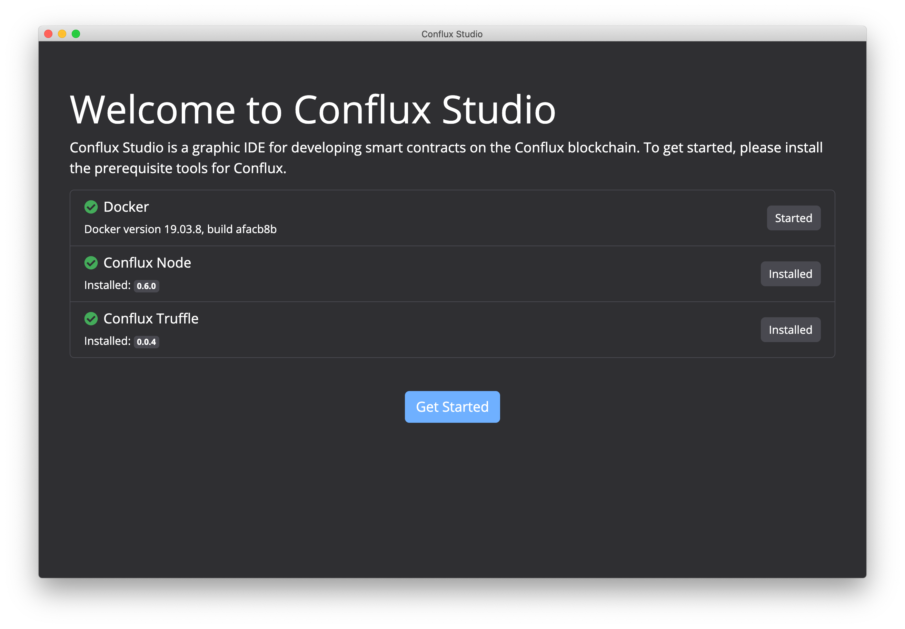
</p>

### 创建钱包

完成所有的安装步骤后，首先需要创建钥匙对来完成后续的合约部署以及调用。

在 Conflux Studio 的任意界面，点击应用左下⻆的钥匙图标，打开密钥管理器。点击 *Create* 按钮打开新钥匙对弹窗，输入钥匙对的名字并点击 *Save* 按钮。完成后将在密钥管理器中看到刚刚生成的钥匙对的地址，这个地址将作为后续教程中最常使用的地址。

导出私钥可以通过点击每个地址后面的眼睛按钮打开查看私钥弹窗，弹窗显示地址以及私钥。后续教程中会需要通过管理器导出私钥。

<p align="center">
  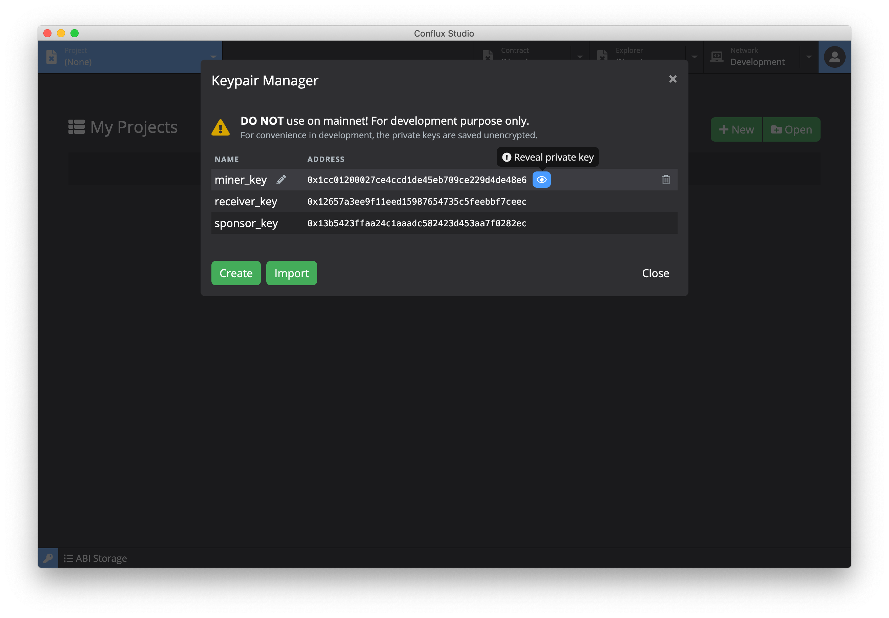
</p>

### 连接Conflux网络

本教程将在 Oceanus 网络进行合约的部署以及合约的调用。点击顶部 *Network* 标签的倒三角打开下拉菜单，点击选择 *Oceanus* 网络进行切换。

切换完成后，可以在主页面中看到当前网络为 *oceanus*。页面左边包括了当前网络的节点 *URL*，*Chain ID*，*TPS* 信息，页面右边包含了当前网络区块的信息。

<p align="center">
  
</p>

### 申请测试CFX

点击顶部 *Explorer* 标签打开区块浏览器，并在地址栏粘贴钥匙对地址，可以看到这个地址在 Oceanus 网络下的余额为 0 CFX。

<p align="center">
  
</p>

在区块链的世界中，大家通常将申请测试 Token 的方式称为 faucet。

获取 CFX 的方式有两种方式：
- 输入地址后点击地址栏右边的水龙头按钮，Conflux Studio 将为地址自动申请 CFX
- 你也可以直接在浏览器中输入 `https://wallet.confluxscan.io/faucet/dev/ask?address={address}` 来申请 CFX

<p align="center">
  
</p>

完成 CFX 申请后，稍等片刻后刷新当前地址的信息，可以看到余额更新为 100 CFX。

## 智能合约

### 创建项目

点击顶部左边的 *Project* 标签切换至项目列表页面，点击页面中的 *New* 按钮打开项目创建窗口，输入项目的名称并选择 *coin* 模版，点击 *Create Project* 完成项目的创建。

<p align="center">
  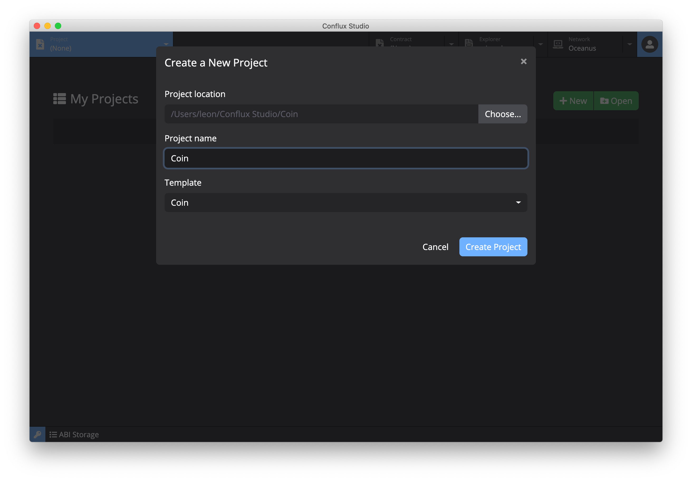
</p>

### 合约代码

Coin 合约是一个简单的代币合约。通过 *mint* 方法可以增发代币数量。通过 *send* 方法可以将一定数量的代币转账给别的用户，同时会在事件中记录下这笔转账的信息。通过 *balanceOf* 方法可以查询到指定账户地址的代币余额。

<p align="center">
  
</p>

Conflux 智能合约使用 [Solidity](https://github.com/ethereum/solidity) 语言进行开发，打开目录下的 `contracts/Coin.sol` 文件，这个是本项目的核心代码：

``` c++
// 指定了 Solidity 的版本，通过 Pragmas(https://solidity.readthedocs.io/en/latest/layout-of-source-files.html#pragmas) 告诉编译器本代码可以兼容的版本为 0.5.0 到 0.7.0
pragma solidity >=0.5.0 <0.7.0;

// 定义 Coin 的合约
contract Coin {
    // 定义了两个 State Variables(https://solidity.readthedocs.io/en/latest/structure-of-a-contract.html#state-variables)
    address public minter;
    mapping (address => uint) public balances;

    // 定义了 `Sent` 的事件，定义了 from / to / amount 列
    event Sent(address from, address to, uint amount);

    // Coin 合约的 constructor ，在 constructor 中指定了 minter 的地址
    constructor() public {
        // msg.sender 为部署合约时签名的账户地址，将这个地址赋值给 minter
        minter = msg.sender;
    }

    // 定义 mint 方法，通过此方法来增发代币
    function mint(address receiver, uint amount) public {
        require(msg.sender == minter);
        require(amount < 1e60);
        balances[receiver] += amount;
    }

    // 定义 send 方法，通过此方法可以给别的账户转账代币
    function send(address receiver, uint amount) public {
        require(amount <= balances[msg.sender], "Insufficient balance.");
        balances[msg.sender] -= amount;
        balances[receiver] += amount;
        // 通过 emit 触发 Sent 事件，记录这笔转账的信息
        emit Sent(msg.sender, receiver, amount);
    }

    // 定义 balanceOf 方法，这是个 view 类型的方法，用于查询账户余额
    function balanceOf(address tokenOwner) public view returns(uint balance){
      return balances[tokenOwner];
    }
}
```

### 编译及部署合约

点击工具栏的 *Build* 按钮进行合约的编译，编译后的结果将会保存在 `build/Coin.json` 文件中。 

<p align="center">
  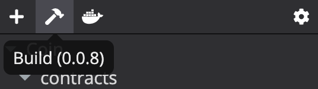
</p>

在部署合约前，首先需要确认在 Explorer 中选择合约部署所使用的地址，Conflux Studio 会使用这个地址将部署合约这笔交易进行签名（选择的方法为在 *Explorer* 的地址栏中输入地址）。在合约代码的 `constructor` 中，`minter` 被赋值为 `msg.sender`，这个 `msg.sender` 就是 Explorer 所选择的地址。

<p align="center">
  
</p>

点击工具栏的部署按钮进行部署，部署完成后，部署结果会在 `deploys` 的 JSON 文件中，在这个文件中可以在 `contractCreated` 中找到当前合约部署的地址，这个合约地址将在后面的教程中使用。

<p align="center">
  
</p>

## 调用合约

点击顶部的 *Contract* 标签切换至合约页面，在地址栏输入地址并加载合约。

<p align="center">
  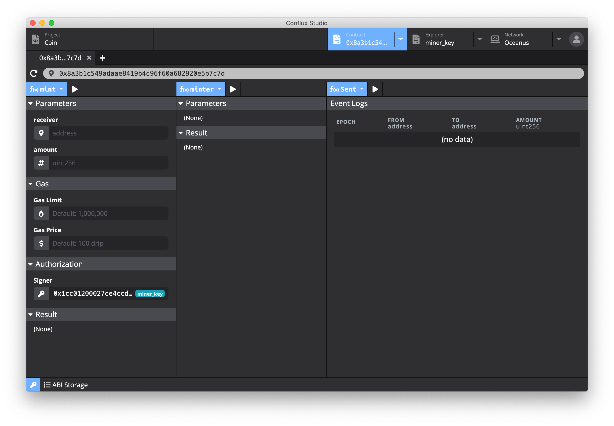
</p>

合约页面由三个部分组成：

- 左边为合约调用区域
- 中间为合约数据查询区域
- 右边为事件查询区域

### 合约调用及查询

#### 增发代币

点击合约调用的下拉菜单中选择 *mint* 方法，在下方的参数区域分别填入以下信息：

- *receiver* 接收代币的地址
- *amount* 发行的代币总数
- *Value* 为选填项（在本教程中填 0 或者不填），具体可查看 [Value](#value-参数) 详解
- *Signer* 为这笔交易的签名地址。合约代码里的 `msg.sender` 就是这个值

填写完成后点击执行按钮，Conflux Studio 将自动构造交易并推送到网络中。成功执行后可以在下方 *Result* 中看到这笔成功的交易。

<p align="center">
  
</p>

#### 查询余额

点击查询区域的下拉菜单并且选择 *balanceOf* 方法，这是在代码中定义的查询方法。在下方的 *Parameters* 区域中的 *tokenOwner* 输入要刚才增发代币中填入的 *receiver* 地址并点击执行，就可以在下方的 *Result* 中看到查询账户的余额信息。

<p align="center">
  
</p>

#### 转账代币

在进行转账操作前，在钥匙对管理器新增一个用于接收代币的账户，新增方法可以参考[前文章节](#创建钱包).

在合约调用区域选择 *send* 方法，在 *Parameters* 中分别填入收款人地址（*receiver*）和转账的数量（*amount*），点击执行完成转账。转出的代币数量将会从 signer 账户（签名这笔交易的账户）中扣除。再次查询余额可以看到，账户的代币余额已经更新了。

<p align="center">
  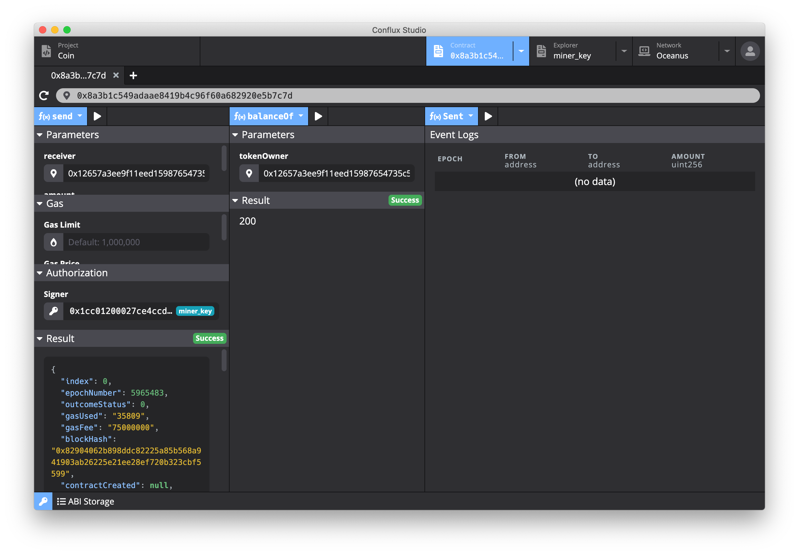
</p>

#### Value 参数

Conflux 智能合约的每个调用的方法都可以带上 *Value* 参数，这是一个可选的参数。如果带上了这个值，智能合约出了在执行这个方法的逻辑外，还会额外转 Value 中指定数量的 CFX token 到 *receiver* 账户，转账金额为 *Value* 中所填的值。有些智能合约的方法需要这个参数才可以完成调用，但是在本教程中，Coin 合约不需要这个参数。

### 查询事件

在事件区域选择 *Sent* 并点击执行，下方的 *Event Logs* 可以看到转账的记录。Sent 事件的列都是由代码中的 Sent 事件的参数来定义的（其中 *epoch* 为事件发生的时间，这个为系统默认列）。在代码中定义了 `Sent` 方法的参数为 `from`， `to` 和 `amount`，分别对应了这笔转账的发起者地址，接受者地址以及转账的数量。

<p align="center">
  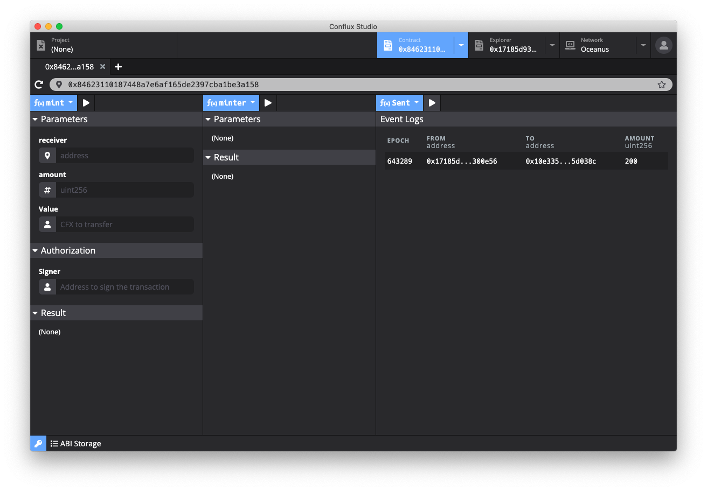
</p>

### 代付功能

敬请期待

## 前端项目

前端项目源码可以前往 [Conflux 前端](https://github.com/ObsidianLabs/conflux-frontend-react)。

### 预备

#### 下载项目并安装依赖

- 下载前端项目：`git clone https://github.com/ObsidianLabs/conflux-frontend-react`
- 使用 `npm install` 或者 `yarn` 进行项目依赖安装

#### Conflux Portal 的安装及配置

Conflux Portal 是由 Conflux 提供的浏览器插件，目前提供了 Chrome 及 Firefox 的支持，用户可以使用 Conflux Portal 进行私钥的管理以及交易签名。

前往 [Conflux Portal GitHub](https://github.com/Conflux-Chain/conflux-portal/releases/latest) 下载安装。项目的源代码在 [GitHub](https://github.com/Conflux-Chain/conflux-portal ) 中可以找到。

在这里需要将 Conflux Studio 中生成的地址导入到 Conflux Portal 中。完成插件安装后，在 Conflux Portal 的页面中选择 *Import*，将 Conflux Studio 中的私钥（在[创建钱包](#创建钱包)章节中介绍了如何将私钥导出）粘贴到输入框中，点击 *Import* 按钮完成私钥导入。

<p align="center">
  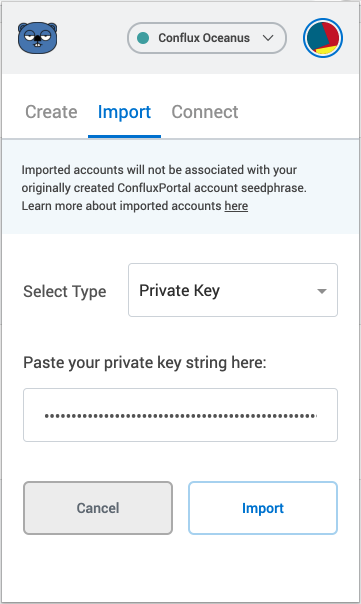
</p>

### 运行前端项目

在运行项目之前，需要修改一些默认的环境变量。

在[前面的教程](#编译及部署合约)中部署合约后会生成一个 `contractCreated`，这个值便是部署在网络中智能合约的地址。打开项目根目录并找到 `.env` 文件，这个文件提供了项目的[环境变量](#前端项目解析)，将 `REACT_APP_CONFLUX_COIN_ADDRESS` 的值修改为 `contractCreated` 中的值。

使用 `yarn start` 启动前端项目，开发服务器运行起来后会在浏览器中打开前端页面（如果没有打开，请在浏览器中访问 http://localhost:3000）。

项目运行起来后，页面将显示四个卡片信息，分别为
- 左上角 Conflux 网络信息模块
- 右上角 Conflux Portal 模块
- 左下角 Coin 合约模块
- 右下角 SponsorWhitelistControl 合约模块

<p align="center">
  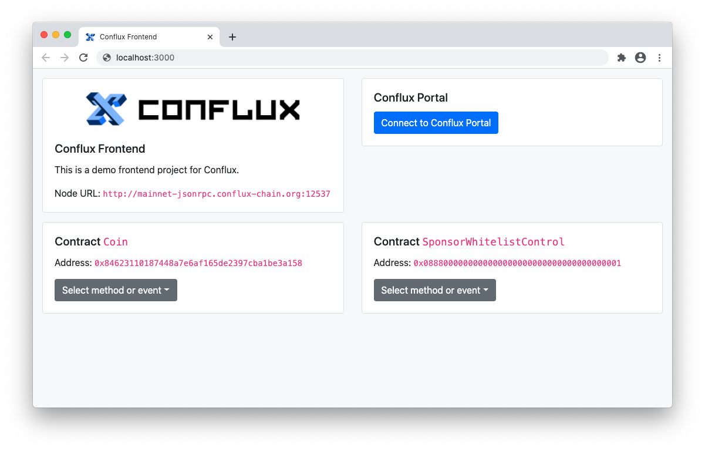
</p>

#### 连接 Conflux Portal

点击右上角组件中的 *Connect to Conflux Portal* 按钮，Conflux Portal 页面将被打开，输入密码和选择账户后完成连接。连接成功后，将会在按钮下看到当前连接的账户地址以及账户中的余额。

<p align="center">
  
</p>

#### 运行 Coin 合约代币增发和代币转账操作

左下角的组件为 Coin 合约组件，可以通过这个组件调用代币增发和代币转账功能。

- 代币增发：选择 *mint* 方法并填入增发地址（*receiver*）和增发的数量（*amount*），点击 *Push Transaction*，在弹出的 *ConfluxPortal Notification* 窗口中点击 *Confirm* 按钮来确认交易。

- 代币转账：选择 *send* 方法并填入收款人地址（*receiver*）和转账的数量（*amount*），点击 *Push Transaction*，在弹出的 *ConfluxPortal Notification* 窗口中点击 *Confirm* 按钮来确认交易。

<p align="center">
  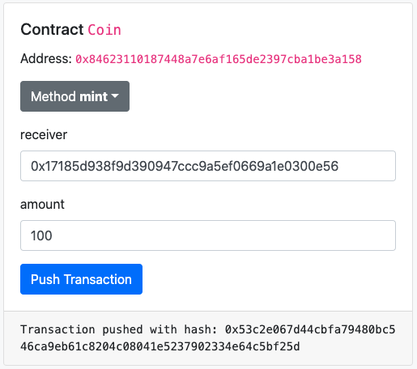
</p>

#### 查看 Coin 合约中的余额

选择 *balanceOf* 方法并在 *tokenOwner* 输入框中填入查询的地址，点击 *Query Data* 按钮可以查询到账户的余额。 

<p align="center">
  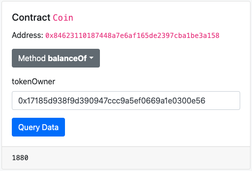
</p>

#### 查看 Sent 事件

选择 *Sent* 事件并点击 *Query Data* 可以查询到转账操作所触发的转账事件的记录。

<p align="center">
  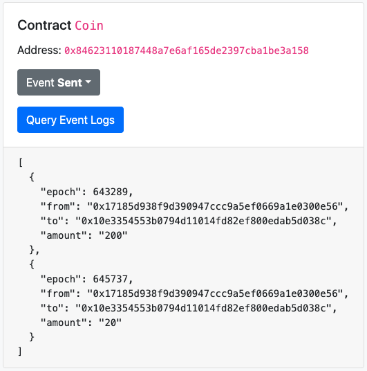
</p>

### 前端项目解析

项目使用 [React](https://reactjs.org) 进行开发。主要由三大部分组成：视图组件、js-conflux-sdk 以及 Conflux Portal。

项目根目录下的 `.env` 环境变量，在这里定义了两个环境变量，分别为
- `REACT_APP_CONFLUX_NODE_RPC`：Conflux 的网络节点地址，目前默认为 Oceanus 网络的地址
- `REACT_APP_CONFLUX_COIN_ADDRESS`：已部署的 Coin 智能合约地址

#### 视图组件

视图组件在项目的 `src/components` 中，其中 `App.js` 为页面的主入口，负责页面的排列及合约信息的读取。

<p align="center">
  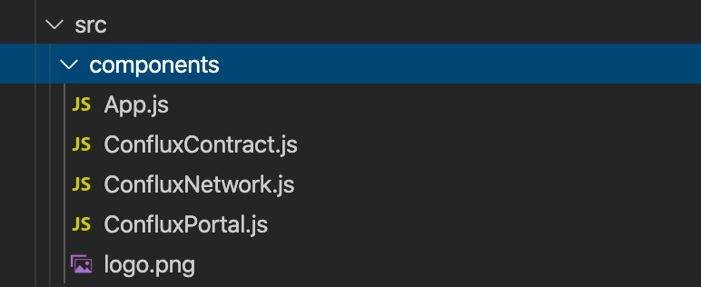
</p>

##### ConfluxNetwork.js

负责渲染 Conflux 网络信息，`Node URL` 的值为 `.env` 环境变量文件下的 `REACT_APP_CONFLUX_NODE_RPC` 设置的值（默认为 Oceanus 网络）。

##### ConfluxPortal.js

负责渲染 Conflux Portal 的连接信息，并提供了连接 Conflux Portal 的交互按钮。

- `connectConfluxPortal` 调用 Conflux Portal 的 `enable` 方法启用 conflux （conflux portal 实例由浏览器插件注入到 windows.portal 中），完成 `enable` 后调用 `getAccount` 方法获取到 Portal 中的账户。
- `refreshBalance` 调用 Conflux SDK 的 `getBalance` 方法来更新账户余额信息
- `renderPortalButton` 根据当前不同的状态，渲染连接 Portal 的按钮

##### ConfluxContract.js

负责渲染 Conflux 合约信息，本项目中提供了 Coin 和 SponsorWhitelistControl 两个合约。

`ConfluxContract.js` 由三个组件组成，分别为

- `ConfluxContract` 负责根据传入的合约 abi 来渲染合约的信息，包括合约地址、合约方法和事件，合约提交的交互逻辑及显示执行后的结果
- `ContractMethods` 负责渲染合约 abi 中的方法和事件的表单及相对应的按钮
- `ConfluxForm` 负责根据方法或事件的 abi 来渲染输入表单

#### lib

lib 在项目的 `src/lib` 中，这里的文件主要是为视图提供包括连接网络、构造交易、获取账户、读取合约等服务。

<p align="center">
  
</p>

##### conflux.js

`conflux.js` 是 `js-conflux-sdk` 的封装。[`js-conflux-sdk`](https://github.com/Conflux-Chain/js-conflux-sdk) 是由 Conflux 提供的 JavaScript SDK，本前端项目使用 SDK 来连接 Conflux 网络，和合约进行交互以及构造合约中的实例。

##### conflux-portal.js

`conflux-portal.js` 是 Conflux Portal 的封装，本前端项目通过调用浏览器插件来完成交易的签名。调用 Conflux Portal 提供的 `enable` 方法可以启动项目和 Conflux Portal 的连接（需要提前检查浏览器是否正确安装插件，在 constructor 中通过检查 `window.conflux` 是否为空来判断）。`conflux-portal.js` 提供了获取账户 `getAccount` 和发送交易 `sendTransaction` 两个主要的方法。

##### abi

`lib/abi` 文件夹下提供了两个 json 文件，分别为 `Coin.json` 和 `SponsorWhitelistControl.json`，这两个文件是构造合约所需要使用的 abi 文件。

## 总结
在本开发教程中，我们学习了如何使用 Conflux Studio 来完成一个完整的 coin 合约开发，其中包括了：

- 使用钥匙对管理器创建账户及导出账户私钥
- 切换 Oceanus 网络，查看网络信息
- 账户申请 CFX Token
- 创建、编译并部署项目
- 解析 coin 合约代码，学习如何编写合约的读写方法及事件
- 使用合约浏览器调用 coin 合约的代币增发、转账、查询余额及查询事件
- 将私钥导入 Conflux Portal 并连接前端项目
- 在前端项目中调用 coin 合约的代币增发、转账、查询余额及查询事件
- 解析前端项目代码，学习如何通过 Conflux Portal 和 Conflux JavaScript SDK 连接网络并实现交易
